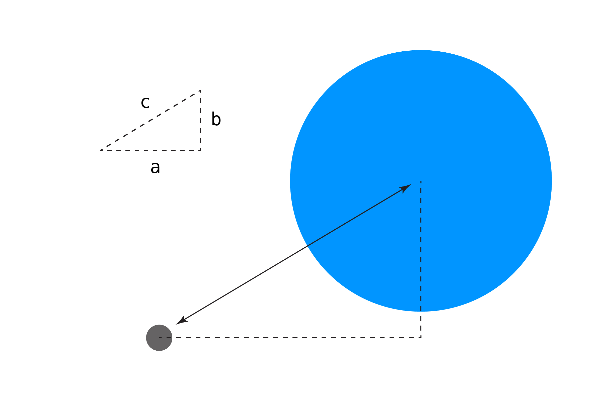
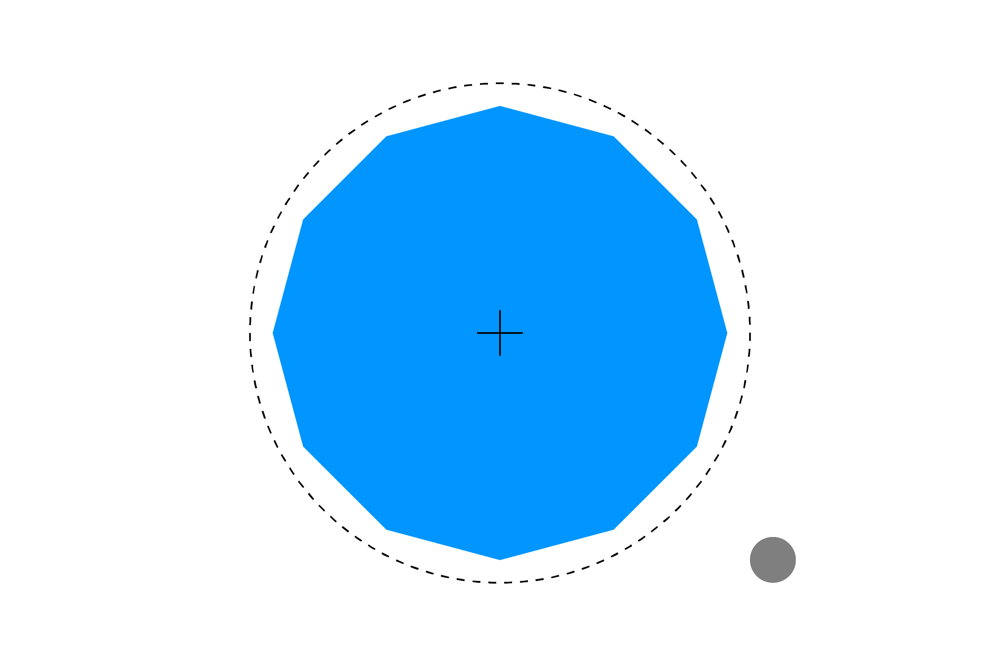

<!-- index -->

https://www.jeffreythompson.org/collision-detection/code/Introduction/web-export/Introduction.pde

# Detección de Colisiones

### Jeff Thompson

La colisión de objetos es la base de la mayoría de las experiencias de juego e interfaces de usuario. Los bates de béisbol chocan con las pelotas, los zombies chocan contra las paredes y Mario aterriza en plataformas y pisa tortugas. Incluso algo tan simple como hacer clic en un botón (un rectángulo) con el mouse (un punto) es una colisión.

Este libro explica los algoritmos detrás de esas colisiones usando formas básicas como círculos, rectángulos y líneas para que puedas implementarlas en tus propios proyectos.

> ¡ACTUALIZACIÓN! Este sitio ha recibido muchas visitas, lo cual es genial. He realizado algunos cambios para que se vea mejor en dispositivos móviles, facilite la navegación y he tratado de revisar todo en busca de errores. Si tiene algún problema o sugerencia, publique un problema en el repositorio del proyecto. ¡Gracias!

¿Listo para comenzar? Salta al índice de contenido...

## ¿QUÉ SE CUBRE AQUÍ?

Este libro cubre las colisiones entre puntos, círculos, rectángulos, líneas, polígonos y triángulos. Estos ejemplos están diseñados para ser lo más legibles y fáciles de entender posible. Definitivamente hay formas más rápidas y eficientes de detectar estas colisiones, pero este libro está diseñado para ser amigable y enseñar los principios con un mínimo de matemáticas.

Cada sección incluye una descripción del algoritmo de colisión y un ejemplo interactivo creado con processing.js. Puedes ver el código fuente de todos los ejemplos (¡y este libro!) en GitHub.

> ¡NOTA! Si estás en un dispositivo móvil, es posible que los ejemplos no funcionen muy bien para ti. Están diseñados para la entrada del mouse, así que si te estás frustrando o tu dedo está en el camino, prueba el sitio en una computadora.

## ¿QUÉ NO ESTÁ?

Como con cualquier libro, hay mucho más material útil del que se podría cubrir aquí. Las cosas que no se discuten se omiten principalmente porque las matemáticas se vuelven demasiado complicadas. No se toca el espacio tridimensional. Las elipses, que parecen bastante fáciles, son en realidad muy difíciles.

Si hay una colisión específica que no se cubre y que sería útil, por favor envía un problema con una solicitud o, mejor aún, envía un ejemplo funcional que hayas creado.

## ¿PROBLEMAS?

Si encuentras código que no se ejecuta correctamente, un algoritmo que no se explica del todo bien o un error tipográfico, infórmalos en el repositorio de GitHub de este proyecto. ¡Gracias por tu ayuda!

## NAVEGACIÓN

¡Bien, vamos a escribir algo de código! Haz clic en el enlace en la parte inferior de la página o en las flechas en la parte superior para pasar al siguiente capítulo. El enlace Detección de colisiones en la parte superior te llevará de regreso al índice de contenido.

<!-- Índice -->

# ÍNDICE

Puedes volver a esta página en cualquier momento haciendo clic en el texto Detección de Colisiones en la parte superior.

## PREÁMBULO

Introducción
Licencia
Lo que ya deberías saber

## SECCIÓN 1

Punto/Punto
Punto/Círculo
Círculo/Círculo
Desafíos

## SECCIÓN 2

Punto/Rectángulo
Rectángulo/Rectángulo
Círculo/Rectángulo
Desafíos

## SECCIÓN 3

Línea/Punto
Línea/Círculo
Línea/Línea
Línea/Rectángulo
Desafíos

## SECCIÓN 4

Polígono/Punto
Polígono/Círculo
Polígono/Rectángulo
Polígono/Línea
Polígono/Polígono
Desafíos

## SECCIÓN 5

Triángulo/Punto
¿Dónde Están Los Otros Ejemplos De Triángulos?
Desafíos

## SECCIÓN 6

Pasando a la Colisión Orientada a Objetos
Tratando con Transformaciones de Matrices

## AGRADECIMIENTOS

Un Intento de Enumerar a Aquellos Que Hicieron Esto Posible

<!-- Licencia -->

# LICENCIA

Todo el contenido de este libro, incluidos los ejemplos de código y este texto, se publica bajo una licencia **Creative Commons Attribution-NonCommercial-ShareAlike**. Esto significa:

1. Eres bienvenido a usar este libro y los ejemplos para crear cosas geniales, pero cita este libro en algún lugar de tu proyecto o su documentación.
2. Solo puedes usar el texto y/o código del libro de manera textual para proyectos no comerciales. Eso significa que puedes remixar o hacer tu propia versión del libro, y puedes bifurcar y crear nuevas bibliotecas basadas en el código aquí, siempre que no sean proyectos comerciales (por ejemplo, publicar un libro con una editorial). Estoy encantado de hablar sobre opciones si tienes un trabajo remunerado y te gustaría utilizar algunos de los materiales.
3. Si haces un proyecto que se bifurca o remezcla este libro o código base, debe lanzarse bajo esta misma licencia o una más flexible. ¡Comparte el conocimiento!

> **Pero eres libre de usar las ideas y el código de este libro dentro de tus proyect**os, siempre que esto sea solo una parte de lo que estás trabajando. En otras palabras: ¡puedes construir un juego genial que se base en el código que has visto aquí, incluso si lo vas a vender!

Si tienes alguna pregunta sobre lo que puedes y no puedes hacer con estos ejemplos, ponte en contacto.

<!-- LO QUE YA DEBERÍAS SABER -->

# LO QUE YA DEBERÍAS SABER

Los ejemplos de este libro están escritos en **Processing**, un wrapper para el lenguaje de programación Java. Si bien solo necesitas un poco de experiencia en programación, debes comprender cómo está estructurado un boceto básico de Processing, cómo usar variables, cómo dibujar formas y obtener información del mouse, y cómo funcionan las sentencias `if/else`.

Puede ser útil comprender el uso de objetos `PVector` para almacenar posiciones, pero cubriremos los conceptos básicos si no los has usado antes.

Al final, hablaremos sobre el uso de colisiones en código orientado a objetos. No será necesario comprender la programación orientada a objetos para usar este libro, pero será útil para usar estos temas en proyectos más grandes con muchos objetos chocando entre sí.

> **¿No has usado Processing antes? ¡Esta bien!** Si has usado otro lenguaje de programación antes, debería ser fácil entender estos ejemplos y portar el código al lenguaje que elijas.

## FUNCIONES

El núcleo de los ejemplos de colisión son las _funciones_, por lo que necesitarás estar familiarizado con ellas para usar este libro. Si nunca has creado una función, lee esta sección detenidamente; si ya entiendes este tema, puedes saltar adelante.

Una función es una pieza de código reutilizable y autocontenida. Las funciones se utilizan para operaciones que desea realizar más de una vez, como verificar la colisión entre dos objetos.

Una función devuelve (envía de regreso) un tipo de variable (como `int` o `boolean`). Por ejemplo, aquí hay una función que devuelve la cadena "¡Hola!"

```pde
String diceHola() {
    return "¡Hola!";
}
```

Ten en cuenta que cuando declaramos la función, enumeramos el tipo de variable que se devolverá. La función hace algo útil, luego envía datos de regreso usando el comando return. Si la función no necesita devolver nada (por ejemplo, si todo lo que hace es dibujar un rectángulo), el tipo es `void`. ¿Suena familiar? ¡Las secciones `setup()` y `draw()` de Processing son en realidad funciones!

Las funciones también pueden recibir argumentos o parámetros que se les ingresan. A un argumento se le da un tipo y un nombre (que existe solo dentro de la función); Los argumentos múltiples están separados por comas. Aquí hay una función simple que suma dos números:

```pde
int sum(int a, int b) {
    return a + b;
}
```

Una vez finalizado, puedes usar la función en otra parte de tu código. Por ejemplo, nuestra función `sum()` anterior se puede usar así:

```pde
int result = sum(2, 2);
println(result);
>> 4
```

Todos los ejemplos de este libro son funciones. Se les alimentan parámetros de los objetos que se van a probar (como posición o tamaño) y devuelven un valor `booleano` que indica si se está produciendo una colisión. También se podrían modificar para devolver la posición de la colisión, como en el ejemplo **Línea/Línea**. Asegúrate de mirar el código completo al final de cada ejemplo para ver cómo se estructura y llama la función.

## NÚMEROS DECIMALES (FLOATS)

Notarás a lo largo de este libro que usamos variables de punto flotante. Esto se debe a algunas razones.

Primero, permite una mayor flexibilidad para su uso posterior. Los enteros (números enteros) se pueden pasar a las funciones sin un error, pero lo contrario no sería cierto.

```pde
// Argumento entero a flotante (ok)
int a = 1;
floatFunction(a);

void floatFunction(float f) {
// Processing convierte automáticamente a un float
}

// Argumento flotante a entero (no ok)
float b = 1;
intFunction(b);

void intFunction(int i) {
// esto causará un error
}
```

En segundo lugar, los flotantes nos dan la capacidad de medir con mayor precisión y mover objetos con más suavidad por la pantalla, lo que hace que sus proyectos interactivos se sientan más naturales.

Finalmente, el uso de flotantes facilita mucho la transición de posiciones X/Y separadas al uso de la clase `PVector`, como lo harán los ejemplos más avanzados. Los números dentro de un PVector son flotantes, por lo que esto asegura que nuestras funciones se puedan ajustar fácilmente para trabajar con vectores.

<!-- point-point -->

# PUNTO/PUNTO

La colisión más fácil de probar es entre dos puntos. Para comprobar si se están tocando, simplemente verificamos si sus coordenadas X e Y son iguales!

```pde
if (x1 == x2 && y1 == y2) {
    // ¡Los puntos están en el mismo lugar: colisión!
} else {
    // no colisionan
}
```

Luego podemos envolver este código en una función para hacerlo más utilizable. Como argumentos, pasamos las coordenadas X/Y de ambos puntos. La función devuelve un valor booleano de `true` o `false`, dependiendo de si hay una colisión o no.

```pde
boolean pointPoint(float x1, float y1, float x2, float y2) {
    if (x1 == x2 && y1 == y2) {
        return true;
    }
    return false;
}
```

Tenga en cuenta el pequeño fragmento abreviado anterior: podríamos especificar `else { return true; }`, ¡pero nuestro código hace lo mismo! Nuestra versión es un poco más fácil de leer, una vez que te acostumbras. Piense en `return false;` como el valor predeterminado que se enviará de regreso, a menos que se cumplan ciertas condiciones.

Con nuestra primera función de detección de colisiones en la mano, podemos construir algo útil con ella. ¡Prueba el ejemplo interactivo chocando con el otro punto y observa cómo cambia el color de fondo!

> Notarás que es un poco difícil activar una colisión (¿puedes adivinar por qué?) - un problema que intentaremos solucionar en la **primera sección de desafíos**.

El código para el ejemplo anterior se puede ver aquí. Intenta pegarlo en Processing, ejecutarlo y realizar cambios para ver cómo cambia el comportamiento.

```pde
float px, py;           // punto controlado por el mouse
float targetX = 300;    // coordenadas del punto objetivo
float targetY = 200;


void setup() {
  size(600, 400);
  noCursor();

  strokeWeight(5);    // trazo más grueso = más fácil de ver
}


void draw() {

  // actualizar la posición del punto a las coordenadas del mouse
  px = mouseX;
  py = mouseY;

  // ¡comprueba la colisión!
  // si impacta, haz que el fondo sea naranja; si no, hazlo blanco
  boolean colliding = pointPoint(px, py, targetX, targetY);
  if (colliding) {
    background(255, 150, 0);
  } else {
    background(255);
  }

  // dibujar los dos puntos
  stroke(0,150,255);
  point(targetX, targetY);

  stroke(0,150);
  point(px, py);
}

// PUNTO/PUNTO
boolean pointPoint(float x1, float y1, float x2, float y2) {

  // ¿Están los dos puntos en la misma ubicación?
  if (x1 == x2 && y1 == y2) {
    return true;
  }
  return false;
}
```

¡Felicitaciones, has escrito tu primer programa usando colisión! Esta estructura básica (un ejemplo interactivo, una explicación, algo de código y el código del ejemplo) será la misma en todos los capítulos.

<!-- point-circle -->

# PUNTO/CÍRCULO

La colisión **Punto/Punto** fue muy fácil, pero de aquí en adelante necesitaremos algunas matemáticas básicas para comprobar si los objetos se están tocando. Probar si un punto está dentro de un círculo requiere que recordemos la clase de matemáticas de la escuela secundaria y el **teorema de Pitágoras**:

```pde
a2 + b2 = c2
```

Podemos obtener la longitud del lado largo de un triángulo `c` dada la longitud de los otros dos lados. Traducido al código, se ve así:

```pde
c = sqrt( (a*a) + (b*b) );
```

Multiplica `a` por sí mismo, lo mismo para `b`, suma los dos y obtén la raíz cuadrada del resultado.

¿Por qué necesitamos esto? Podemos usar el teorema de Pitágoras para obtener la distancia entre dos objetos en el espacio 2D. En este contexto, `a` y `b` son las distancias horizontales y verticales entre el punto y el centro del círculo.



Podemos calcular la distancia X e Y de esta manera:

```pde
float distX = px - cx;
float distY = py - cy;
```

Luego podemos encontrar la distancia entre los dos puntos usando el teorema de Pitágoras:

```pde
float distance = sqrt( (distX*distX) + (distY*distY) );
```

Entonces, si el punto está en `(10,10)` y el centro del círculo está en `(40,50)`, obtenemos una distancia de `50`. Podrías estar pensando "¿Qué pasa si la distancia sale negativa?". No se preocupe: dado que multiplicamos los valores de distancia por sí mismos, incluso si son negativos, el resultado será positivo.

Bien, ¿pero cómo usamos esto para probar colisiones? Si la distancia entre el punto y el centro del círculo es menor que el radio del círculo, ¡estamos colisionando!

```pde
if (distance <= r) {
    return true;
}
return false;
```

Usado en un ejemplo completo, podemos cambiar el color del círculo si el punto está dentro de él.

```pde
float px =     0;      // posición del punto
float py =     0;

float cx =     300;    // posición del centro del círculo
float cy =     200;
float radius = 100;    // radio del círculo

void setup() {
  size(600,400);
  noCursor();

  strokeWeight(5);   // trazo más grueso = más fácil de ver
}

void draw() {
  background(255);

  // actualizar la posición del punto a las coordenadas del mouse
  px = mouseX;
  py = mouseY;

  // ¡comprueba la colisión!
  boolean hit = pointCircle(px,py, cx,cy, radius);

  // dibujar círculo
  // cambiar el color de relleno si se golpea
  if (hit) {
    fill(255,150,0);
  } else {
    fill(0,150,255);
  }
  noStroke();
  ellipse(cx,cy, radius*2,radius*2);

  // dibujar el punto
  stroke(0);
  point(px, py);
}

// PUNTO/CÍRCULO
boolean pointCircle(float px, float py, float cx, float cy, float r) {

  // obtener la distancia entre el punto y el centro del círculo
  // usando el teorema de Pitágoras
  float distX = px - cx;
  float distY = py - cy;
  float distance = sqrt( (distX*distX) + (distY*distY) );

  // si la distancia es menor que el radio del círculo
  // ¡el punto está adentro!
  if (distance <= r) {
    return true;
  }
  return false;
}
```

Este método que utiliza el teorema de Pitágoras volverá muchas veces. Processing tiene una función `dist()` incorporada, si lo prefiere, aunque mantendremos las matemáticas como referencia.

Una advertencia: si tienes un objeto que se mueve muy rápido, ¡a veces puede atravesar su objetivo sin que se active una colisión! A esto a veces se le denomina el problema de la "bala a través del papel". Hay muchas soluciones, pero un buen lugar para comenzar sería esta publicación de GameDev.net. Una forma estándar de detectar esto se llama **"Detección continua de colisiones"** o CCD.

<!-- circle-circle -->

# CÍRCULO/CÍRCULO

La colisión con puntos está bien, pero rara vez los objetos ocupan un solo punto en el espacio. A continuación, podemos usar la misma aplicación del teorema de Pitágoras del ejemplo **Punto/Círculo** para probar si dos círculos están colisionando.

Primero, calcula la distancia entre los centros de los dos círculos:

```pde
float distX = c1x - c2x;
float distY = c1y - c2y;
float distance = sqrt( (distX*distX) + (distY*distY) );
```

Para comprobar si están colisionando, vemos si la distancia entre ellos es menor que la suma de sus radios.

```pde
if (distance <= c1r+c2r) {
    return true;
}
return false;
```

Integrado en un ejemplo completo, se ve así:

```pde
float c1x = 0;      // posición del círculo 1
float c1y = 0;      // (controlado por el mouse)
float c1r = 30;     // radio

float c2x = 300;    // posición del círculo 2
float c2y = 200;
float c2r = 100;

void setup() {
  size(600,400);
  noStroke();
}

void draw() {
  background(255);

  // actualizar la posición a las coordenadas del mouse
  c1x = mouseX;
  c1y = mouseY;

  // comprobar la colisión
  // si impacta, cambia el color
  boolean hit = circleCircle(c1x,c1y,c1r, c2x,c2y,c2r);
  if (hit) {
    fill(255,150,0);
  } else {
    fill(0,150,255);
  }
  ellipse(c2x,c2y, c2r*2,c2r*2);

  // otro círculo, controlado por el mouse
  fill(0, 150);
  ellipse(c1x,c1y, c1r*2,c1r*2);
}

// CÍRCULO/CÍRCULO
boolean circleCircle(float c1x, float c1y, float c1r, float c2x, float c2y, float c2r) {

  // obtener la distancia entre los centros del círculo
  // use el teorema de Pitágoras para calcular la distancia
  float distX = c1x - c2x;
  float distY = c1y - c2y;
  float distance = sqrt( (distX*distX) + (distY*distY) );

  // si la distancia es menor que la suma de los radios del círculo,
  // ¡los círculos se están tocando!
  if (distance <= c1r+c2r) {
    return true;
  }
  return false;
}
```

La colisión **Círculo/Círculo** se puede utilizar para crear "círculos delimitadores" alrededor de objetos más complejos. Si bien sacrifica la precisión, este tipo de detección de colisiones es muy rápido y puede ser una buena aproximación.



_Si bien incluye algunas áreas que no forman parte de la forma, un círculo es una buena aproximación de este **dodecagon**._

Quizás se esté preguntando por qué solo estamos hablando de círculos y no de elipses. Puede parecer bastante similar, pero las matemáticas para la **colisión de elipses son en realidad bastante complicadas**. ¡Considéralo un gran desafío una vez que domines los otros ejemplos de colisión!

<!-- SECCIÓN 1 - DESAFÍOS -->

# SECCIÓN 1 - DESAFÍOS

Prueba estos desafíos para modificar el código que hemos escrito. No te frustres si no puedes resolverlos todos, algunos están pensados para programadores más experimentados:

1. Intenta cambiar los colores de los objetos cuando chocan. Pista: busca el comando `fill()` en la sección `draw()`.
2. ¿Puedes hacer que suceda algo más interesante cuando ocurre la colisión? ¿Objetos cambian de tamaño, se mueven por la pantalla, etc.?
3. Nuestra colisión **Punto/Punto** es muy delicada: debes estar en la ubicación exacta del otro punto para que se active la colisión. ¿Puedes modificar el código para incluir una "zona de amortiguamiento" donde ocurra la colisión, incluso si los dos puntos no se están tocando realmente?

<!-- SECTION 2 - Point/Rectangle -->

